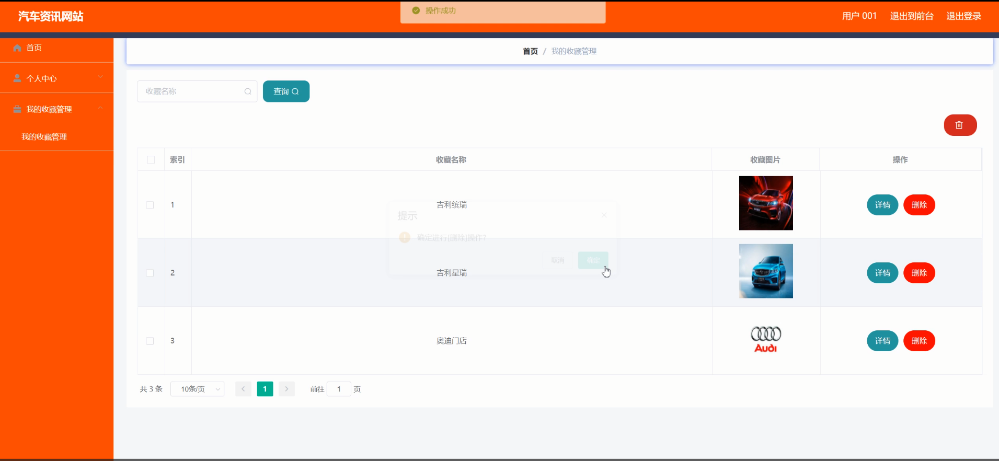

# 基于springboot的汽车资讯网站

#### 介绍

我开发的基于Spring Boot的汽车资讯网站，旨在为用户提供最新的汽车品牌、价格、经销商信息，以及相关的汽车资讯和公告。该系统设有管理员和用户两种角色，分别具备不同的功能模块，确保系统的高效管理和用户的良好体验。

#### 技术栈

后端技术栈：Springboot+Mysql+Maven

前端技术栈：Vue+Html+Css+Javascript+ElementUI

开发工具：Idea+Vscode+Navicate

#### 系统功能介绍

管理员角色功能模块  
个人中心：管理员可以在个人中心管理自己的信息，包括修改密码、更新联系方式等，确保个人信息的准确性和安全性。  
用户管理：管理员可以管理注册用户的信息，包括添加、修改和删除用户，查看用户的活动和反馈。  
汽车品牌管理：管理员可以添加、修改和删除汽车品牌的信息，确保品牌信息的及时更新和准确展示。  
价格分类管理：管理员可以管理汽车价格分类，设置不同价格区间的分类，方便用户根据价格范围进行搜索和筛选。  
经销商管理：管理员可以管理经销商的信息，包括添加、修改和删除经销商，确保经销商信息的准确性和完整性。  
汽车信息管理：管理员可以发布和更新汽车的详细信息，包括车型、配置、价格、图片等，确保信息的全面和及时。  
留言板管理：管理员可以管理留言板的内容，查看用户的留言和反馈，及时处理和回复用户的问题和建议。  
系统管理：管理员可以进行系统的整体管理和维护，包括系统设置、权限管理、日志记录等，确保系统的稳定运行和安全。  

用户角色功能模块  
经销商：用户可以查看经销商的详细信息，包括经销商名称、地址、联系方式等，方便用户选择和联系经销商。  
汽车信息：用户可以浏览和搜索汽车的详细信息，包括品牌、车型、价格、配置等，获取最新的汽车资讯。  
资讯公告：用户可以查看最新的汽车资讯和公告，了解汽车行业的动态和新闻。  
留言反馈：用户可以在留言板上发布自己的问题和建议，与管理员和其他用户进行交流和互动。  
个人中心：用户可以在个人中心管理自己的信息，包括修改密码、更新联系方式等，确保个人信息的准确性和安全性。  
后台管理：  
我的收藏管理：用户可以管理自己收藏的汽车信息，方便快速访问和查看感兴趣的内容。  
民的收藏管理：用户可以查看和管理自己收藏的汽车资讯和公告，保持对感兴趣内容的跟踪和了解。  
 
#### 系统作用

该汽车资讯网站的主要作用包括：  

提供全面的汽车信息：系统汇集了各大汽车品牌的详细信息，包括车型、配置、价格等，帮助用户全面了解汽车市场。  
便捷的经销商查询：用户可以通过系统快速查询和联系经销商，方便购买和咨询汽车相关问题。  
最新的汽车资讯：系统发布最新的汽车资讯和公告，帮助用户了解汽车行业的动态和新闻。  
用户互动与反馈：通过留言板功能，用户可以与管理员和其他用户互动，提出问题和建议，获取及时的帮助和回复。  
个性化管理：用户可以在个人中心管理自己的信息和收藏内容，提升使用体验和满意度。  

#### 系统功能截图

代码结构

数据库表

登录

个人中心

前台页面首页

汽车信息

资讯公告

经销商

留言反馈

用户端后台管理

价格分类管理

系统管理

#### 总结

基于Spring Boot的汽车资讯网站通过整合汽车品牌、价格、经销商、资讯公告等信息，为用户提供了一个全面、便捷的信息平台。系统支持管理员和用户两种角色，各角色具备相应的权限和功能模块，确保系统的高效管理和用户的良好体验。通过科学的功能模块设计和高效的管理机制，系统提升了信息的及时性和准确性，促进了用户之间的互动和交流，为用户提供了全面的汽车资讯和优质的服务。

#### 使用说明

创建数据库，执行数据库脚本 修改jdbc数据库连接参数 下载安装maven依赖jar 启动idea中的springboot项目

后台地址：http://localhost:8080/springbootjtw43/admin/dist/index.html

管理员  abo 密码 abo

前台地址：http://localhost:8080/springbootjtw43/front/index.html